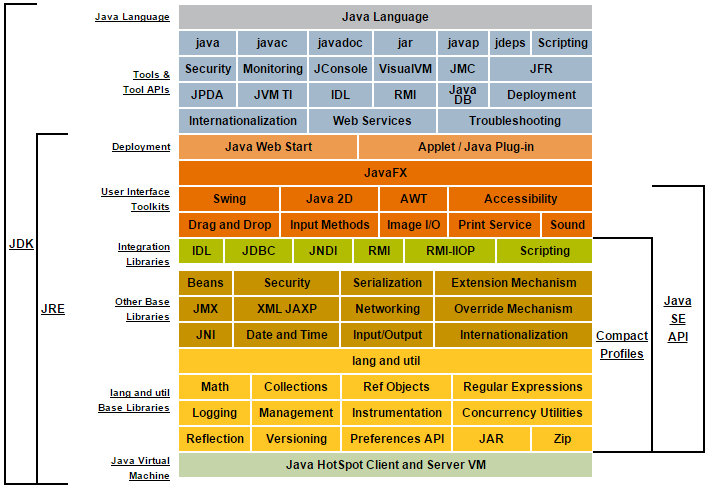
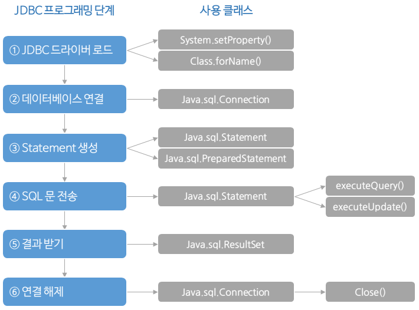

# 1. 자바(JAVA) 언어의 개념

## 1-1. 자바 언어의 이해

자바는 썬에서 개발한 객체지향 언어이다. 가정용 단말기에 적용하려는 목적으로 1992년에 만든 '오크(OAK)'언어에서 비롯되었다.
오크는 상품화되지 못했지만, 인터넷이 발전하면서 인터넷 친화적인 개발 언어로 방향을 전환하여 1995년 '자바'라는 이름으로 새롭게 소개되었다.
현재 자바는 IT 기술 전반에서 가장 널리 사용하는 프로그래밍 언어가 되었다.


<br>


### 1-1-1. 자바 가상머신
자바는 '바이트코드(Bytecode)'를 생성한다. 바이트코드는 하드웨어에 종속적이지 않은 중간 파일로, 가상머신을 거쳐 해석·실행하는 구조이다.
가상머신으로 자바는 스마트폰, 컴퓨터, Mac, 리눅스 등 서로 다른 기기나 운영체제에서 동일한 프로그램을 개발하고 실행할 수 있다.


<br>


### 1-1-2. 자바 플랫폼
자바 플랫폼은 자바 프로그램이 실행되는 특정 환경을 말한다.
여러 제약(화면, 입출력 장치, 성능 등) 때문에 모든 하드웨어나 적용 분야에서 동일한 자바를 사용하는 것은 불가능하다. 각 영역에 특화된 자바 플랫폼이 있다.
대표적인 자바 플랫폼 기술로 Java SE(Standard Edition), Java ME(Micro Edition), Java EE(Enterprise Edition), Java Card, Java TV 등이 있다.


<br>

### 1-1-3. Java SE 구조

 

JDK(Java Development Kit): 자바 프로그램 개발에 필요한 구성 요소
JRE(Java Runtime Environment): 자바 프로그램 실행에 필요한 구성 요소
API(Application Programming Interface): 자바 응용 프로그램 개발에 사용하는 라이브러리

<br>

### 1-1-4. 자바의 장점
- 간결하면서도 강력한 객체지향 언어이다.
- 개방형 구조로 여러 기술과 융합이 가능하다.
- 플랫폼에 독립적이므로, 여러 운영체제나 하드웨어에서도 동일하게 실행한다.
- 많은 오픈소스 프레임워크로 생산성을 증가하고 유지보수 비용을 절감할 수 있다.

<br>

### 1-1-5. 자바의 단점
- 처리 속도가 중요한 애플리케이션에는 적합하지 않다.
- GUI 요소가 많은 MS 윈도우 응용 프로그램 개발에는 적합하지 않다.
- 하드웨어에 연결하여 제어할 수 없기 때문에(가상머신 이용) 직접 - 하드웨어를 정밀하게 조정해야 하는 프로그램 개발에는 적합하지 않다.

<br>

### 1-1-6. 자바 프로그램 개발 절차
- 자바 프로그램 개발은 자바 소스 코드(.java) 작성 → 자바 컴파일러 → 자바 바이트코드(.class, 컴파일) → 자바 가상머신(JVM) → 운영체제, 하드웨어 → 실행의 단계로 진행한다.
- 바이트코드는 운영체제에 상관없이 가상머신에서 실행하는 중간 코드이다.

<br>
 
### 1-1-7. 자바 소스 프로그램 작성 및 실행
- IDE(통합개발환경)는 기본적으로 프로젝트 단위로 소스 파일을 관리한다.
보통 프로그램은 여러 개의 클래스와 필요한 라이브러리를 비롯한 기타 리소스(자원)로 구성한다.
- IDE(통합개발환경)에서 자바 코드는 자바 파일 생성이 아니라 클래스를 작성하는 것으로 시작한다.
- IDE(통합개발환경)는 자동으로 코드를 컴파일하기 때문에 코드 작성이 끝나면 컴파일도 함께 끝나는 셈이다.
자바 클래스를 실행하려면 main() 메서드가 있어야 하며, [Run] - [Run As] - [Java Application] 메뉴로 실행한다.
실행 결과 System.out.println()은 콘솔 창에 출력된다.
 
<br><br><br>

# 2. 자바의 기초 문법

## 2-1. 변수와 자료형
- 변수는 프로그램에서 데이터를 저장하는 공간을 말하고, 자료형은 변수에 저장할 데이터의 유형을 말한다.

<br>

### 2-1-1. 변수 이름 규칙
- 변수 이름의 길이에는 제한이 없다.
- 반드시 문자나 언더바(_), 달러 기호($)로 시작해야 한다.
- 자바의 연산자(+, -, *, /)는 변수 이름에 넣을 수 없다.
- 대소문자를 구분한다(int result와 int Result는 다른 변수).
첫 글자에 숫자가 올 수 없고, 이름 사이에 빈칸을 넣어서도 안 된다. 빈칸 대신 언더바(_)를 사용한다.
- 자바의 키워드는 변수 이름으로 사용할 수 없다.
- 자바에서 변수 선언은 명시적으로 데이터형을 지정하게 되어 있으며, 선언된 데이터 유형과 대입된 데이터값에 차이가 있을 때 오류나 오버플로, 언더플로가 발생하므로 주의한다.
- 자바의 변수는 유형에 따라 인스턴스 변수, 클래스 변수, 지역 변수, 파라미터로 구분한다.
- 자바에서 지원하는 기본 자료형(Primitive Data Types)은 크게 정수형, 실수형, 논리형으로 나눈다.
 

### 2-1-2. printf()의 형식 문자와 자료형

| 형식 문자 | 자료형 | 형식 문자 | 자료형 |
|----------|---------------|----------|-----------------|
| %c | 문자형 | %o | 8진수 |
| %d | 정수형 | %s | 문자열 |
| %e | 지수형 | %u | 부호 없는 정수형 |
| %f | 실수형 | %x | 16진수 |
| %d | 정수형 | %%, \% | % 문자 출력 |
 
<br>

### 2-1-3. 정수형

| 자료형 | 크기 | 입출력 범위 | 설명 |
|---------|-----------|---------------|------------------------------|
| byte | 1바이트 | -2^7 ~ 2^7-1 | 작은 범위의 값을 저장하기에 유용하다. 컴퓨터 데이터 통신 프로그램에서 많이 사용한다. |
| char | 2바이트 | 0 ~ 2^16-1 | 음수를 표현하지 않는 unsigned 자료형으로, 문자를 저장하거나 출력하는 용도로 사용한다. |
| short | 2바이트 | -2^15 ~ 2^15-1 | 메모리에서 차지하는 크기가 작다는 것이 장점이지만, 잘 사용하지 않는다. |
| int | 4바이트 | -2^31 ~ 2^31-1 | 정수 타입의 연산에 기본이 되는 자료형이다. |
| long | 8바이트 | -2^63 ~ 2^63-1 | 정수 표현 범위가 큰 데이터를 저장하기에 유용한 자료형이다. |

<br>

### 2-1-4. 실수형

| 자료형 | 크기 | 입출력 범위 | 설명 |
|---------|-----------|---------------|------------------------------|
| float | 4바이트 | 1.4E^-45 ~ 3.402823E^38 | 표현 범위가 작다. 값을 지정할 때 숫자 뒤에 f나 F를 붙여서 구분한다. |
| double | 8바이트 | 4.9E^324 ~ 3.402823E^308 | 실수형에서 사용하는 기본 데이터형이다. |
 
<br>

### 2-1-5. 논리형

boolean: 1바이트, true 값 또는 false 값만 가진다.

<br> 

### 2-1-5. 연산자

연산자는 프로그래밍 언어에서 사용할 수 있는 다양한 계산식이다.
컴퓨터 연산자에는 사칙 연산, 관계 연산, 논리 연산 등이 있다.
 

### 2-1-6. 연산자 우선 순위 

| 우선순위 | 연산자 |
|--------|--------------------------|
| 1	| ., [], () |
| 2	| !, ~, +/-, ++/--, (cast) |
| 3	| +, -, *, /, % |
| 4	| <<, >>, >>> |
| 5	| <, >, <=, >=, ==, != |
| 6	| &, ^, &#124; |
| 7	| &&, &#124;&#124; |
| 8	| [조건식]?[true]:[false] |
| 9	| =, +=, -=, *=, /=, %=, <<=, >>=, ^=, &=, != |
| 10 | ++/--(후위형 증감 연산자) |
 

### 2-1-7. 산술 연산자
| 분류 | 연산자	| 설명 |
|-------------|----------|-------------------------------------------|
| 이항 연산자 | | |
| |	+ | 두 수의 합을 구한다. |
| |	- | 두 수의 차를 구한다. |
| |	* | 두 수의 곱을 구한다. |
| |	/ | 두 수를 나눈 몫을 구한다. |
| |	% | 두 수를 나눈 나머지를 구한다. |
| |	+= | 좌변과 우변을 더한 결과를 좌변에 대입한다. |
| |	-= | 좌변에서 우변을 뺀 결과를 좌변에 대입한다. |
| |	%= | 좌변에서 우변을 나눈 나머지를 좌변에 대입한다. |
| 단항 연산자 | | |	
| | ++ | 변수값을 1 증가시킨다. |
| | -- | 변수값을 1 감소시킨다. |
| 관계 연산자 | | |
| | >	| 왼쪽 항이 크면 참, 아니면 거짓. |
| | <	| 오른쪽 항이 크면 참, 아니면 거짓. |
| | >=	| 왼쪽 항이 크거나 같으면 참, 아니면 거짓. |
| | <=	| 오른쪽 항이 크거나 같으면 참, 아니면 거짓. |
| | ==	| 왼쪽과 오른쪽 항이 같으면 참, 아니면 거짓. |
| | !=	| 왼쪽과 오른쪽 항이 다르면 참, 아니면 거짓. |
| 논리 연산자 | | |
| | &&	| 두 항의 논리값이 참이면 참, 아니면 거짓. |
| | &#124;&#124; | 두 항의 논리값 중 하나 이상의 항이 참이면 참, 아니면 거짓. |
| | !	| 단항 연산을 하며, 연산되는 항이 참이면 거짓, 거짓이면 참. |
| 삼항 연산자 | | |
| | [조건식]?[true]:[false]	| 조건식의 결과가 참일 때 [true] 항을 수행하고, 아니면 [false] 항을 수행한다. |
| 비트 연산자 | | |
| | &	| 두 항의 비트가 모두 1이면 1, 아니면 0으로 연산. |
| |	&#124;	| 두 항의 비트가 모두 0이면 0, 아니면 1로 연산. |
| |	^	| 두 항의 비트가 서로 다르면 1, 같으면 0으로 연산. |
| |	>>	| 왼쪽 피연산자를 오른쪽 값만큼 부호 비트로 채우면서 오른쪽으로 이동시킨다. |
| |	<<	| 왼쪽 피연산자를 오른쪽 값만큼 비트를 왼쪽으로 이동시킨다. |
| |	>>>	| 왼쪽 피연산자를 오른쪽 값만큼 부호 비트를 무시한 채 0으로 채우면서 오른쪽으로 이동시킨다. |
| | &=	| 두 항의 비트가 모두 1이면 1, 아니면 0으로 연산하여 왼쪽 피연산자에 대입한다. |
| | &#124;= | 두 항의 비트가 모두 0이면 0, 아니면 1로 연산하여 왼쪽 피연산자에 대입한다. |
| | ^=	| 두 항의 비트가 서로 다르면 1, 같으면 0으로 연산하여 왼쪽 피연산자에 대입한다. |
| | >>=	 | 왼쪽 피연산자를 오른쪽 값만큼 부호 비트로 채우면서 오른쪽으로 이동한 후 대입한다. |
| | <<=	 | 왼쪽 피연산자를 오른쪽 값만큼 비트를 왼쪽으로 이동한 후 대입한다. |

<br>

----------------

<br>

# 3. 제어문

## 3-1. 조건분기문

분기문은 프로그램을 개발할 때 논리적 수행을 지원하는 명령어이다.
자바에서 지원하는 분기문은 if 문과 switch 문이 있다.
if 문은 중첩 사용이 가능하며, if ~ else if ~ else 문 등 응용이 가능하다. switch 문은 정수형뿐만 아니라 문자열 비교로 case별 처리가 가능하다.


```java
if(조건값 1) {
    명령문;
} else if(조건값 2) {
    명령문;
} else if(조건값 3) {
    명령문;
} else {
    명령문;
}
```

```java
if(조건값 1) {
    명령문;
    if(조건값 2) {
        명령문;
    }
} else {
    명령문;
    if(조건값 3) {
        명령문;
    }
}
```

```java
switch(조건값) {
    case 조건 1:
        명령문;
        break;
    case 조건 2:
        명령문;
        break;
    case 조건 3:
        명령문;
        break;
    default:
        명령문;
        break;
}
``` 

## 3-2. 반복문

반복문은 순환문이라고도 하며, 분기문과 함께 프로그램에서 기본적인 로직을 구성하는 기본 문법 중 하나이다.
패턴이 일정하여 반복적으로 일을 수행할 때 순환문을 사용하면 쉽게 결과를 확인할 수 있다. 자바 언어에서 지원하는 순환문으로는 for 문과 while 문이 있다.
for 문은 시작과 조건, 증감식 등으로 구성된다. while 문은 조건을 충족하는 동안 계속 수행하는 반복문으로 경우에 따라 do ~ while 문의 형태로도 사용이 가능하다.

```java
for(초기값; 조건값; 증감식) {
    명령문;
}
```

```java
while(조건값) {
    명령문;
}
```

```java
do {
    명령문;
} while(조건값)
```

<br><hr><br>

# 4. 참조 타입(Reference Type)

## 4-1. 배열

배열은 인덱스(순차 번호)와 인덱스로 참조 가능한 데이터로 된 일종의 자료구조이다.
배열은 집합형 데이터 관리가 필요할 때 사용하며, 원시 자료형뿐만 아니라 객체 타입도 지원한다.
배열은 선언할 때 크기를 지정해야 하고, 나중에 변경할 수 없다. 또 배열 안 모든 데이터는 동일한 자료형이어야 한다.
배열 안 데이터를 참조하는 인덱스는 0부터 시작하고, 데이터가 할당되지 않은 인덱스 위치를 참조할 때 Null Pointer Exception이 발생한다.
 
<br>

----------------

<br>

# 5. 객체지향형 프로그래밍(Object Oriented Progrmming)

객체지향이란 현실 세계의 개체 모델을 바탕으로 프로그램을 구조화하고 개발하는 프로그래밍 기법을 말한다.
함수와 메서드(Method)가 비슷하며, 기본적으로는 객체 간의 메시지 교환을 이용한 프로그래밍 모델이다.
상속, 추상화, 캡슐화 등 특징을 활요한 구조적이고 재활용 가능한 모듈화로 생산성과 유지보수 효율성을 높인 프로그래밍 언어이다. 대표적으로 스몰토크(SmallTalk), C++, C#, Net, 자바, 파이썬(Python) 등이 있다.
 
<br><br> 

## 5-1. 객체(Object)
객체를 뜻하는 'Object'는 기본적으로는 '사물'이라고 해석된다. 사물은 우리 눈에 보이는 모든 것을 말하며, 그 사물이 가진 속성(Attribute)과 행위(Behavior)로 설명할 수 있는 대상이다.

<br><br> 

## 5-2. 클래스와 인스턴스
속성이 같은 객체들을 대표할 수 있는 대상을 클래스(Class)라고 한다. 예를 들어 소나무는 클래스가 되고, 주변에 보이는 각 소나무들은 모두 소나무 클래스의 인스턴스(객체)가 되는 것이다.
클래스는 객체를 정의하는 틀이며, 필드(속성)와 메서드(행위)로 구성한다. 클래스는 추상화를 이용하여 슈퍼 클래스(상위 클래스, 부모 클래스)와 서브 클래스(하위 클래스, 자식 클래스)로 구분한다.
인스턴스는 클래스에서 생성한 객체로, 고유한 상태가 있다. 동일한 클래스에서 생성된 객체라 할지라도 필드 값과 메서드의 내용은 다를 수 있다.
 
<br><br>

## 5-3. 상속
상속은 어떤 클래스에서 좀 더 내용이 구체적인 새로운 클래스가 필요할 때 기존 클래스를 물려받아 새로운 부분만 추가하거나 수정하려고 만든 개념이다.
상속을 이용하면 슈퍼 클래스의 기본 구성 요소(필드, 메서드)를 물려받으며(상속), 자신만의 필드나 메서드를 추가하여 구체화하는 것이 가능하다. 물론 물려받은 메서드의 내용을 수정하는 것도 가능하다.
상속은 클래스를 선언할 때 extends 키워드를 사용하여 정의한다.
 
<br><br>

## 5-4. 객체지향 프로그래밍의 주요 특징
캡슐화: 생성한 객체를 어떤 메서드와 필드로 어떻게 일을 수행할지 외부에 숨기는 특성을 말한다.
상속: 클래스는 추상화된 슈퍼 클래스와 구체화된 서브 클래스로 구성한다. 그리고 슈퍼 클래스와 서브 클래스의 고나계를 상속이라고 한다. 자바에서는 다른 객체지향 언어와 달리 다중 상속을 지원하지 않는다.
다형성: 클래스의 상속 관계를 이용하여 슈퍼 클래스가 같은 서버 클래스들이 동일한 요청을 다르게 처리할 수 있는 특징을 말한다. 실제 프로그램에서는 메서드를 오버라이딩(재정의)하여 구현한다.

<br><br> 

## 5-5. 자바 클래스의 기본 구조

패키지: 자바 클래스들을 같은 성격으로 묶어서 관리하는 일종의 디렉터리 개념이다. 역 도메인(Reverse Domain) 방식으로 이름을 부여한다.
클래스: 자바 프로그램은 기본적으로 클래스를 만드는 것에서부터 시작한다. 클래스는 자바 프로그램의 기본 단위이며, 프로그램 실행을 위한 main() 메서드를 반드시 클래스에 포함해야 하는 것으 아니다.
인스턴스: 객체지향의 개념에 따라 클래스는 바로 사용할 수 없고, 인스턴스로 사용해야 한다. main() 메서드에서는 클래스의 인스턴스를 만들고, 인스턴스를 이용하여 메서드 호출 등 필요한 작업을 처리한다.
참조 변수: 자바 클래스의 인스턴스 참조를 위한 변수이다. 구조는 일반적인 변수와 유사하지만, 참조 변수에는 데이터가 없고 클래스 인스턴스를 가리킨다.
생성자: 클래스를 생성할 때 제일 먼저 실행되는 특수한 형태의 메서드로, 리턴값이 없으면 메서드 이름은 반드시 클래스 이름과 일치해야 한다.
리턴값이 없다. 따라서 void를 비롯한 리턴값의 데이터형을 입력하면 안 된다.
파라미터가 있는 다른 여러 생성자를 정의할 수 있다(메서드 오버로딩).
파라미터가 없는 기본 생성자(Default Constructor)는 특별히 생성자에서 처리해야 하는 일이 없다면 굳이 프로그램에서 구현할 필요가 없다. 다만 생성자를 여러 개 정의할 때는 반드시 기본 생성자를 명시해야 기본 생성자로 객체 생성이 가능하다.
 
<br><br>

## 5-6. 접근 한정자(제어자)의 종류와 접근 범위

| 한정자 | 클래스 내부 | 동일 패키지 | 하위 클래스 | 그 외의 영역 |
|--------------|-------|-------|------|------|
| public	| O	| O	| O	| O |
| protected	| O	| O	| O	| X |
| default	| O	| O	| X	| X |
| private	| O	| X	| X	| X |

<br><br> 

## 5-7. 일반 한정자(지시자)의 종류
static: 클래스 메서드와 클래스 변수를 선언하는 데 사용한다. static은 자바의 정적 영역에 할당되는 리소스를 선언하는 데 사용하며, 동일 가상머신상에서 실행 중인 모든 클래스에서 공유한다. 인스턴스를 생성하지 않고도 클래스의 메서드나 멤버에 접근할 수 있다.

final: 더 이상 변경할 수 없도록 선언하는 한정자. 클래스에 사용할 때는 서브 클래스를 만들 수 없고, 메서드에 사용할 때는 오버라이딩을 할 수 없다. 변수에 사용하면 변수에 저장된 값이 변할 수 없으므로 변수가 아닌 상수의 역할을 한다.

abstract: 추상 클래스를 선언하는 데 사용하는 한정자.

synchronized/volatile: 스레드 프로그래밍에서 여러 스레드가 동시에 자원에 접근할 때 발생하는 데이터 동기화를 처리하는 한정자.

<br><br> 

## 5-8. 인스턴스 변수와 클래스 변수

- 인스턴스 변수는 클래스의 인스턴스로만 접근 가능한 변수를 말하며, 일반적인 멤버 변수가 여기에 속한다. 클래스 외부에서 접근을 차단하려고 private 키워드를 사용하기도 한다.
- 동일 클래스의 인스턴스라 해도 각 인스턴스 변수는 값이 서로 다르고 서로에 영향을 주지 않는다.
- 클래스 변수는 모든 클래스의 인스턴스로 공유되는 변수로, static 키워드를 사용하여 선언한다. 클래스가 인스턴스되기 전(main() 메서드 시작 부분)에는 인스턴스 변수에 접근할 수 없으므로 main()에서 멤버 변수에 바로 접근하는 것은 불가능하다.
 

## 5-9. 자바 가상머신의 메모리 구조
| Method 영역 | Heap 영역 | Stack 영역 |
|--------------------|------------------|--------------------|
| 메서드 바이트코드	| 자바 객체	| 메서드 파라미터 |
| 클래스(static) 변수 | 인스턴스 변수 | 지역 변수 |
 
<br><br>

# 6. 추상 클래스와 인터페이스

- 추상 클래스와 인터페이스는 객체지향 개념을 실제 프로그램 개발에 쉽게 적용하고 유연한 설계를 지원하는 요소이다.
- 일반 클래스보다 추상적인 관점에서 접근한다. 구체적인 내용보다는 기본적인 속성과 필요한 메서드의 형태(프로토 타입)만 기술하고 세부적인 구현은 구현하는 클래스에서 담당하도록 하는 형태이다.

<br>

## 6-1. 추상 클래스

- 추상 메서드(구현되지 않고 정의만 한 메서드)를 하나 이상 포함한다. 추상 메서드가 포함된 클래스는 반드시 추상 클래스로 정의해야 한다.
- 추상 클래스는 일반 클래스와 같이 멤버 변수 및 메서드를 포함할 수 있다.
- 추상 클래스는 그 자체를 인스턴스화, 즉 객체 생성에 사용할 수 없으며, 반드시 추상 클래스를 상속받는 클래스를 만든 후 추상 클래스에 선언된 모든 추상 메서드를 오버라이딩해서 구현해야 한다.
 
<br>

## 6-2. 인터페이스

- 인터페이스는 일반 메서드를 포함할 수 없으며, 모두 추상 메서드(public abstract)로만 구성해야 한다.
일반 멤버 필드는 없고, public, static, final로 선언한 상수만 있다.
- 추상 클래스와 마찬가지로 직접 객체를 생성하는 것은 불가능하고(Anonymous Inner Class 생성 형태로는 가능), 다른 클래스로 구현할 때는 implements 키워드로 구현을 선언해야 한다.
- 클래스 상속과는 별도로 동작하므로 문법상 다중 상속을 지원하지 않는 자바에서 다중 상속의 개념을 지원하는 형태로 사용하는 것이 가능하다.
 
<br>

## 6-3. 메서드 오버로딩과 메서드 오버라이딩

- 메서드 오버로딩과 메서드 오버라이딩은 자바에서 다형성을 지원하는 구현 형태 중 하나이다.
- 메서드 오버로딩은 메서드 이름은 동일하지만 파라미터가 다른 여러 메서드를 만드는 것을 말한다.
    - 메서드 오버로딩의 조건은 다음과 같다.
        - 메서드 이름이 같아야 한다.
        - 파라미터의 개수 또는 타입이 달라야 한다.
        - 파라미터는 같고 리턴 타입이 다르면 오버로딩이 성립되지 않는다.
- 메서드 오버라이딩은 슈퍼 클래스에서 정의한 메서드를 서브 클래스에서 재정의하는 것을 말한다.
    - 메서드 오버라이딩의 조건은 다음과 같다.
        - 오버라이딩하는 메서드는 슈퍼 클래스의 메서드와 메서드 구성 요소 모두가 동일해야 한다. 이때 이름, 파라미터, 리턴 타입이 모두 같아야 한다.
 

# 7. 자바 기본 라이브러리 활용

## 7-1. 자바 API

API는 Application Programming Interface의 약어로, 응용 프로그램 개발에 사용할 수 있는 라이브러리 규격을 말한다.

※ 일반적인 자바 프로그램에서는 Java SE API를 주로 사용하며, 개발에 주로 활용하는 유용한 패키지들은 다음 표와 같다.

| 주요 기능 | 설명 | 주요 패키지/클래스 |
|--------------|------------------------------------------|----------------|
| lang and util | 자바 언어의 주요 구성 요소와 관련된 패키지 | java.lang, java.util |
| Math | 각종 수학 계산과 관련된 클래스 및 유틸리티 | java.math, java.lang.Math |
| Collections | 다양한 자료구조를 동일한 방법으로 처리할 수 있도록 하는 라이브러리	| java.util |
| Input/Output | 키보드, 네트워크, 파일 등 입출력 관련 주요 기능을 제공하는 라이브러리 | java.io, java.nio, java.net |
| Date and Time | 시간 및 날짜 처리 관련 라이브러리 | java.util, java.text |
| Networking | 네트워크 통신 프로그래밍 관련 라이브러리 | java.net |
| Swing/AWT | GUI 구현 관련 라이브러리 | java.swing, java.awt, javax.swing |
| JDBC | 데이터베이스 프로그래밍 관련 라이브러리 | java.sql |

<br>

### 7-1-1. JDBC 처리 구조 


<br> 

## 7-2. java.lang 패키지의 주요 클래스

- java.lang은 자바 언어의 가장 기본이 되는 클래스를 모아 둔 패키지이다.
- String 클래스는 문자열 처리를 위한 클래스로, 자바에서 문자열은 기본 자료형이 아니라 클래스를 사용하는 객체 타입이다.
문자열을 비교할 때는 '=='이 아닌 equals() 메서드를 사용한다.
더하기 연산을 수행하면 문자열 결합이 가능하다. 그러나 자바 문자열 특성상 기존 데이터를 대체하는 것이 아니라 계속 새로운 인스턴스를 생성하기 때문에 성능에 문제가 발생할 수 있으므로 주의해야 한다.
- StringBuffer 클래스는 성능에 영향을 받지 않고 문자열 처리를 하는 클래스이다. 긴 문자열 조합은 문자열 더하기 대신 StringBuffer를 사용하는 것이 좋다.
- Wrapper 클래스는 자바의 기본 자료형을 객체 타입으로 처리할 수 있도록 만든 클래스이다. 기본 자료형에 대응하는 클래스들이 모두 준비되어 있다. 각 Wrapper 클래스에는 해당 데이터 타입과 관련된 유용한 기능들이 제공된다.
- System 클래스는 자바 프로그램을 실행하는 것과 관련된 유용한 기능들을 제공한다.
 
<br>

## 7-3. java.util 패키지의 주요 클래스
- java.util은 프로그램을 개발할 때 유용한 기능을들 모아 놓은 유틸리티 클래스 패키지이다.
- 날짜 처리는 프로그램을 개발할 때 중요하면서도 생각보다 손이 많이 가는 작업이다. java.util.Date, java.util.Calendar 클래스의 주요 메서드와 필드 등을 잘 활용해야 한다.
- Calendar 클래스는 추상 클래스라 인스턴스 생성이 안 되며, getInstance() 메서드를 사용해야 한다.
- 날짜 형식 변환은 java.text의 클래스를 사용해야 한다.
- Scanner 클래스는 입력 스트림으로, 데이터를 입력받는 클래스이다. 고급 입출력은 자바 I/O에서 제공하는 클래스들을 사용해야 하며, Scanner 클래스는 상대적으로 간단한 입력을 처리하는 데 사용한다. 객체를 생성할 때 입력 스트림을 변경하면 키보드 외의 파일, 네트워크 등에서 데이터 입력을 받아올 수 있다.
- Random 클래스는 난수를 생성하는 클래스이다. 일련의 규칙에 따라 난수를 생성하는 관계로, 객체를 생성할 때 현재 시간 정보를 시드(Seed)로 하여 더 유용한 난수 생성이 가능하다. 난수 생성 범위를 지정하면 0부터 시작하므로 1부터 시작해야 할 때는 생성된 난수에 1을 더하도록 한다.
- StringTokenizer 클래스는 구분자로 연결된 문자열을 손쉽게 분리(파싱)하는 클래스이다. 일반적으로 구분자에는 공백, 콤마, 탭 등을 많이 사용한다. 특히 콤마로 구분된 데이터는 csv 포맷이라고 하여 엑셀과도 호환된다.
 
<br>

## 7-4. java.text 패키지의 주요 클래스
- java.text 패키지는 주로 문자 형태로 구성된 정보의 변환을 지원하는 클래스들로 구성되어 있다.
- 날짜 형식을 지정하는 클래스로 DateFormat과 SimpleDateFormat이 있으며, 자바 8에는 java.time API가 새롭게 추가되었다.
- DateForamt은 추상 클래스로 getInstance()를 사용해야 하며, 형식 제한이 있고 다양한 형식 지정을 원할 때는 SimpleDateFormat 클래스를 사용해야 한다. 날짜 지정 형식은 yyyy.MM.dd hh:mm과 같은 형식 지정 문자를 조합해서 원하는 대로 할 수 있다.
- 숫자 형식 지정은 NumberFormat과 DecimalFormat 클래스를 사용할 수 있다. 날짜와 함께 숫자 역시 프로그램을 개발할 때 여러 변환이 필요한 데이터 중 하나이다. 화폐 단위를 비롯하여 자릿수 지정 등 숫자와 관련된 유용한 기능들을 제공한다.
메시지는 문자열로 구성된 의미있는 데이터를 말한다. 프로그램이나 시스템 간에 데이터를 송수신할 때 이용할 수 있고, 규칙화된 문자열 패턴에 데이터를 매핑하는 용도로도 사용한다. 
- MessageFormat 클래스는 패턴과 데이터 조합을 쉽게 연결하여 원하는 문자열을 만들 수 있도록 도와준다.
 
<br><hr><br>

# 8. 자바 I/O와 네트워크 프로그래밍

## 8-1. 자바 I/O

- I/O는 Input/Output, 즉 입력과 출력을 말한다. 자바에서는 java.io 패키지로 다양한 입출력 기능을 제공한다.
- 스트림(Stream)은 입출력 장치와 프로그램 간 데이터 전송 통로를 말한다. 스트림은 단방향으로만 뻗어 있으며, 연속된 데이터의 흐름으로 나타난다.
- 입출력 프로그램은 입력 및 출력 장치, 네트워크, 컴퓨터에 유/무선으로 연결된 장치 등을 모두 스트림 기반으로 프로그램하는 것이 가능하다.
 
<br>

## 8-2. 바이트 스트림과 문자 스트림
- 바이트 스트림은 바이트 단위로 데이터를 전송하고, 문자 스트림은 2바이트 단위로 문자를 전송한다. 예를 들어 숫자 17을 전송할 때 문자 스트림은 숫자 17 그대로 전송하지만, 바이트 스트림은 16진수 0x11이 바이트 단위 0001 0001로 전송된다는 차이가 있다.
- 문자 스트림은 Reader와 Writer 클래스 계열을 사용하고, 바이트 스트림은 InputStream, OutputStream 클래스 계열을 사용한다.
바이트 스트림 중 DataInputStream과 DataOutputStream은 자바의 기본 자료형 처리에 적합한 클래스로, 주로 바이너리 데이터 전송에 많이 사용한다.
스트림을 사용한 후에는 항상 close() 메서드를 사용하여 닫아 줘야 다른 프로그램에서 해당 장치와 연결할 수 있다.
 
<br>

## 8-3. 자바 파일 입출력
- 파일은 컴퓨터에서 가장 기본이 되는 중요한 입출력 대상이다. 컴퓨터의 특성상 메모리에 저장된 데이터는 컴퓨터 전원이 꺼지면 사라지므로, 모든 프로그램은 어떤 형태로든 파일을 사용한다.
- 디렉터리는 파일을 체계적으로 관리하려는 것으로, 폴더라고도 한다. 디렉터리의 최상위를 루트라고 하며, 유닉스 계열은 '/', MS 윈도우 계열은 '\'를 디렉터리 구분자로 사용한다.
- 경로는 디스크상의 파일이나 디렉터리 위치를 말하는 것으로, 디렉터리 구분자와 함께 사용한다. 유닉스는 /home/user1/data/my.txt와 같은 형식을 사용하고, 윈도우는 C:\home\user1\data\my.txt와 같은 형식을 사용한다.
- 파일 입출력 프로그램은 File 클래스를 사용하여 원하는 파일 작업을 위한 객체를 생성하고, 입출력 스트림을 생성하여 프로그램하는 방식이다.
File 클래스는 바이트 스트림과 문자 스트립 계열의 클래스를 모두 지원하며, RandomAccessFile 클래스는 임의의 파일 위치를 읽고 쓸 수 있는 기능을 제공한다.
 
<br><hr><br>

# 9. 자바 네트워크 프로그래밍

네트워크는 컴퓨터와 컴퓨터를 연결한 망형 조직을 말하며, 기업 내 컴퓨터를 연결한 랜(LAN)에서부터 전 세계가 하나로 연결된 인터넷까지 모두 네트워크라고 할 수 있다.
네트워크의 기술적 유형에는 여러 가지가 있었지만, 지금은 TCP/IP라는 통신 프로토콜을 사용하는 컴퓨터 네트워크가 가장 일반적인 인터넷의 기반이 되었다.
프로토콜은 컴퓨터와 컴퓨터가 데이터를 주고받는 규약을 말하며, 물리적 레벨에서 응용 프로그램 레벨까지 다양한 프로토콜이 있다.
네트워크 프로그램은 데이터를 요청하는 클라이언트와 서비스를 제공하는 서버로 구분한다.
포트는 서버에서 네트워크 접속을 받아들이는 연결 창구를 말한다. 포트에 따라 서로 다른 여러 서비스를 제공할 수 있다.
소켓은 TCP/IP 네트워크에서 클라이언트와 서버가 통신하는 연결 통로를 말한다. 서버 입장에서는 클라이언트 연결 하나당 하나의 소켓 객체가 필요하다. 따라서 보통 네트워크 프로그램을 소켓 프로그래밍이라고도 한다.
최근에는 URL을 이용하여 웹 서버의 자원에 접근하는 네트워크 프로그램이 늘어나고 있다. 이는 웹의 프로토콜인 HTTP를 이용한 것으로, 기존 웹 프로그램과 웹 사이트에서 운영 중인 정보를 손쉽게 연동할 수 있다는 점 때문에 널리 확산되었다. 자바에서는 URL 클래스로 HTTP 연결을 지원한다.
ServerSocket 클래스는 클라이언트 연결을 지원하는 서버 프로그램에서 사용하고, Socket 클래스는 클라이언트 및 서버에서 클라이언트 접속을 처리하려고 사용한다.
Socket을 사용하여 입출력 스트림을 확보할 수 있으며, 이후의 프로그램은 스트림을 사용하는 일반 자바 입출력 프로그램과 동일하다.
네트워크 프로그램은 클라이언트와 서버가 상호작용을 해야 하므로 프로토콜 개념이 들어가야 하고, 다중 클라이언트 접속을 처리하려면 스레드 프로그램도 해야 하므로 정밀한 네트워크 프로그램 개발에는 많은 경험이 필요하다.
 
<br><hr><br>

# 10. GUI 프로그래밍

## 10-1. GUI 프로그래밍
- GUI는 Graphical User Interface의 약어로, 그래픽 기반의 사용자 인터페이스를 말한다.
- GUI는 일반적으로 사용자가 운영체제를 쉽게 사용하도록 만든 개념으로, 키보드를 이용하여 텍스트 기반으로 운영체제나 프로그램을 제어하는 CLI(Command Line Interface)와 구분된다.

※ GUI 인터페이스와 응용 프로그램의 관계는 다음과 같다.

```
사용자 입력 → GUI 사용자 인터페이스 ↔ (입력, 출력) ↔ 응용 프로그램
```

자바에서는 GUI 프로그래밍을 할 수 있게 AWT와 Swing이라는 두 가지 라이브러리를 제공하며, 자바 8에서는 JavaFX가 기본 GUI 기술로 자리 잡았다.
화면을 구성하는 버튼, 스크롤 바, 창, 아이콘, 툴바, 메뉴 바 등을 컴포넌트라고 한다.

<br>

## 10-2. GUI 프로그램의 구조

새로운 프레임이나 창으로 객체를 생성하여 프로그램을 시작한다.
레이아웃 객체를 이용하여 기본 레이아웃을 정의한다.
화면 구성에 필요한 컴포넌트들을 생성하고, 레이아웃에 배치한다.
사용자와 상호작용(클릭, 키보드 입력, 마우스 이동)을 하는 이벤트 핸들러를 등록한다.
이벤트가 발생할 때 처리하는 코드를 구현한다.

<br> 

### 10-2-1. 레이아웃

컴포넌트를 응용 프로그램에 배치하는 것을 말한다.
자바에서는 레이아웃 관리자를 이용하여 레이아웃을 배치한다. 많이 사용하는 레이아웃에는 FlowLayout, GridLayout, BorderLayout, CardLayout 등이 있다.
레이아웃은 컨테이너 클래스, 즉 다른 컴포넌트를 담을 수 있는 객체인 Fream, Panel 클래스에 적용할 수 있다.
각 레리아웃마다 특징적인 요소들을 속성이나 메서드로 설정하거나 컴포넌트를 컨테이너에 추가할 때 레이아웃 속성을 추가하면 원하는 위치에 배치할 수 있다.

<br> 

### 10-2-2. 이벤트

GUI 프로그램에서 발생하는 특정 시점의 의미있는 신호로, 사용자의 입력 결과를 응용 프로그램에 전달한다.
마우스, 키보드 등은 대표적인 이벤트 발생 소스라고 할 수 있다.
예를 들어 마우스 버튼을 누르면 이벤트가 발생하고, 버튼에 등록된 이벤트 핸들러 클래스로 전달되어 이벤트와 관련된 코드를 수행하는 형태이다.

※ 이벤트 처리 과정은 다음과 같다.

```
마우스, 키보드 → (인터럽트 시그널이 발생) → AWT 스레드 → (이벤트 발생) → 이벤트 프로세싱(addXxxListener - (Listener 등록) - 이벤트 핸들러) → (이벤트 전달) → 이벤트 핸들러
```

이런 이벤트 모델은 자바, 안드로이드, iOS 등 여러 운영체제에서 거의 비슷한 형태로 적용된다.
이벤트 핸들러 클래스의 이름은 XxxListener 형태이다.
이벤트 처리 구현 방식에는 핸들러 클래스를 프로그램의 메인 클래스가 구현하는 방식과 별도의 클래스로 만드는 방법, 내부 클래스 및 익명의 내부 클래스 방식이 있다.
이벤트 처리 절차는 다음과 같다.
구현 방식에 따라 이벤트를 처리하는 핸들러를 사전에 정의한다.
이벤트 처리가 필요한 컴포넌트 대상을 정하고, 해당 컴포넌트에 이벤트 핸들러를 등록한다.
이벤트 핸들러 클래스에서 요구하는 메서드를 오버라이딩하고, 이벤트를 발생할 때 필요한 기능을 구현한다.
 
<br><hr><br>

# 11. 자료구조와 컬렉션 프레임워크

## 11-1. 자료구조

자료구조는 자료를 효율적으로 이용할 수 있도록 컴퓨터에 저장하는 방법을 말한다.
컴퓨터 분야에서는 프로그램 연산에 필요한 데이터들을 효과적으로 사용하려고 고안했다.
자료구조를 구현하려면 문제를 해결하는 데 적절한 알고리즘이 필요하다.
 

## 11-1-1. 자료구조의 종류

배열(Array): 동일한 타입의 데이터를 연속된 공간에서 관리하는 자료구조이다. 크기가 고정되어 있고 0부터 시작하는 인덱스로 접근할 수 있다.
연결 리스트(Linked List): 배열과 유사하지만 논리적으로 연속된 자료 관리를 지원한다. 각 데이터는 노드(Node)로 구분되고, 각 노드에는 다음 데이터의 위치 정보가 들어간다.
이중 연결 리스트(Double Linked List): 단순 연결 리스트에 이전 데이터의 위치 정보가 추가된 것으로 처음 노드와 마지막 노드를 연결시키면 환형 연결 리스트(Circular Linked List)가 된다.
해시 테이블(Hash Table): 임의의 메모리 공간에 데이터를 (Key, Value) 쌍으로 저장하는 형태의 자료구조이다. 내부적으로 버킷(Bucket)이라는 공간으로 구성된 테이블 형태를 취하며, 해시함수를 사용하여 키값을 버킷의 위치 정보로 변환한다.
스택(Stack): 데이터를 차곡차곡 쌓는 형태의 자료구조이다. 마지막에 들어간 데이터가 제일 먼저 참조되는 구조(LIFO, Last In First Out)이다. 스택을 이용하면 처리한 작업을 역순으로 진행하는 것이 가능하다.
큐(Queue): 스택과 유사하지만, 먼저 들어온 순서대로 데이터를 처리한다. 요청과 처리를 동시에 할 수 없을 때 먼저 요청된 작업을 먼저 처리하는 용도로 사용한다. 프린터 큐, 비디오 버퍼링 등에 응용한다.
트리(Tree): 모든 노드가 루트(Root)라는 최상위 노드에서 시작하며, 각 노드는 부모-자식 관계를 가진다. 컴퓨터 하드디스크의 폴더 구조도 트리 구조이다. 자식 노드가 없는 노드는 리프 노드(Leaf Node)라고 한다.
그래프(Graph): 연결되어 있는 객체 간의 관계를 표현할 수 있는 자료구조이다. 그래프의 핵심은 탐색으로 주어진 노드 간의 최소 경로나 최적 경로를 구하는 데 필요한 알고리즘을 구현하는 것이다. 그래프는 G = (V, E)로 표현한다.

<br><br> 

## 11-2. 자바 컬렉션 프레임워크

컬렉션 프레임워크는 자료구조와 관련된 여러 클래스를 정의한 큰 틀로, 자바 자료구조 클래스 개발의 기반이 된다.
기본적으로 Collection 인터페이스를 상속받는 Set, List, Queue, Deque 인터페이스와 Map 인터페이스를 상속받는 SortedMap 인터페이스로 구성된다. 실제로 프로그램을 작성할 때는 AbstractList, AbstractQueue, AbstractSet, AbstractMap, Dictionary 등 클래스와 이것을 상속받는 ArrayList, HashMap 등 클래스를 주로 사용한다.
컬렉션 프레임워크를 이용하여 개발자가 복잡한 알고리즘 등을 구현하는 데 들이는 시간과 노력을 줄일 수 있고, 고성능의 자료구조를 제공하여 프로그램의 성능을 향상시킬 수 있다. 또 자료구조 API를 따로 배울 필요가 없고, 표준화된 컬렉션 인터페이스 구조를 제공하여 소프트웨어 재사용이 촉진된다.
List는 연속된 자료를 처리하는 인터페이스로, 연결 리스트와 구조가 동일하다. ArrayList와 LinkedList가 실제로 구현된 클래스이다.
Set은 중복되지 않은 자료를 (Key, Value) 쌍으로 저장하고 검색하는 자료구조로, 해시 테이블 구조를 제공한다. Map은 Set과 기본적으로 동일하며, 자료의 중복을 허용한다는 차이만 있다.

<br> 

### 11-2-1. ArrayList

자바에서 가장 널리 사용하는 자료구조 클래스이다. 배열과 유사한 형태의 데이터 관리가 필요할 때 사용할 수 있다. 배열과 달리 크기를 지정할 필요가 없고, Object형 원소를 지정하여 다양한 데이터 처리가 가능한 것이 특징이다.
Object 타입의 데이터를 일관되게 처리하려면 객체 선언을 할 때 제네릭 타입을 반드시 지정해야 한다.
add() 메서드로 데이터를 추가하고, get() 메서드로 데이터를 가져온다. 데이터 참조는 배열과 마찬가지로 0부터 시작되는 인덱스 값을 사용한다.
대량의 데이터를 구성한 후 반복해서 참조할 때 유용하게 활용한다.

<br> 

### 11-2-2. HashMap

기본적으로 (Key, Value) 쌍으로 데이터를 관리하는 자료구조를 제공하며, 전체 데이터 중 특정 데이터만 신속하게 검색해야 할 때 유용하다.
키, 값 모두 제네릭 타입을 명시해 주는 것이 좋다.
put() 메서드로 데이터를 추가하고, get() 메서드로 데이터를 가져온다. 데이터를 가져오는 경우에는 저장할 때 쓴 키 값을 사용한다.
ArrayList와 달리 전체 데이터를 순차적으로 접근하는 것은 불편하고, 필요하다면 values() 메서드로 Collection 타입으로 변환한 후 사용할 수 있다.
 
<br><hr><br>

# 12. 데이터베이스 프로그래밍

## 12-1. JDBC

JDBC는 Java DataBase Connectivity의 약어로, 자바에서 데이터베이스 연동 프로그램을 할 수 있도록 만든 기술이다.
JDBC는 데이터베이스 연결 및 쿼리에서 표준화된 인터페이스를 정의한다. 데이터베이스 회사에서는 자신들의 데이터베이스에 맞는 JDBC Driver를 개발하여 배포하기 때문에 개발자들은 데이터베이스 회사와 상관없이 표준화된 API를 이용하여 프로그램을 개발할 수 있다.
프로그램에서 JDBC를 사용하려면 해당 데이터베이스 제품에 맞는 JDBC Driver가 필요하다. 보통 .jar 파일로 배포하는데, 자바의 클래스 경로상에 있어야 프로그램에서 참조가 가능하다.
 
<br>

## 12-2. JDBC 프로그램 개발 절차

JDBC는 정해진 규칙과 절차에 따라 프로그램해야 한다.
JDBC Driver의 이름은 JDBC를 구현한 클래스 이름으로, 데이터베이스 회사마다 다른 이름을 사용한다. MySQL은 com.mysql.jdbc.Driver이다.
JDBC URL은 프로그램에서 특정 데이터베이스에 접속하려고 접속 관련 정보를 표현한 것이다. JDBC Driver 이름과 마찬가지로 각 데이터베이스 회사마다 조금씩 다른 구성을 사용한다. MySQL은 jdbc:mysql://DB서버의 IP 주소/스키마:PORT이다.
데이터베이스 프로그램을 작성할 때는 사용한 DB 연결 자원을 반드시 반납해야 한다. 예를 들어 Statement, PreparedStatement, ResultSet, Connection 등은 close() 메서드를 사용하여 연결을 종료한다.
DB 조회 결과를 처리하는 ResultSet 객체는 실제 데이터를 가져오는 것이 아니라 검색된 데이터의 위치 정보로 자원을 close()하기 전에 getXxx() 메서드를 사용하여 필요한 데이터를 확보하는 것이다.

<br><hr><br>


# 13. 자바 고급 프로그래밍 기술

## 13-1. 예외 처리

예외 처리는 프로그램 수행 과정에서 발생할 수 있는 문제점을 사전에 검토하고, 예상치 못한 문제가 발생했을 때 처리를 강제하는 자바 언어의 구현 특징 중 하나이다.
자바에서 오류는 프로그램 문법이나 잘못된 라이브러리 참조 등으로 발생하는 컴파일 오류와 프로그램 실행 과정에서 발생하는 런타임 오류로 구분한다. 예외는 일종의 런타임 오류에 해당하며, 프로그램을 실행할 때 발생하는 예기치 못한 상황을 의미한다.
throws는 구현하는 메서드에서 특정 예외를 처리하지 않음을 명시적으로 선언하는 것이다. 이때 메서드 안에서는 try ~ catch 구문을 사용할 필요가 없고, 메서드를 호출하는 쪽에서 예외 처리를 요구한다.

※ 예외 처리의 기본 구문은 다음과 같다.

```java
try {
    //예외 처리를 요구하는 메서드 호출 부분
} catch (XXException e) {
    //예외 처리 코드 블록
} finally {
    //예외 상황이나 그렇지 않을 때 모두 처리되는 블록
}
``` 

## 13-2. 스레드

스레드는 프로세스에서 독자적인 명령어 제어권을 갖고, 프로세스에 있는 리소스를 공유하는 프로그램의 실행 단위를 말한다.
프로세스는 기본적으로 컴퓨터에 실행 중인 프로그램을 의미하는 용어로, 운영체제에서 프로그램의 실행을 관리하는 단위이다. 스레드는 프로세스 안에서 동시에 여러 작업을 수행하는 작업 단위로 경량 프로세스라고도 한다.
스레드 프로그래밍으로 얻을 수 있는 장점과 단점은 다음과 같다.

※ 장점
- 시스템 자원을 절약할 수 있다.
- 사용자에 대한 응답성이 향상된다.
- 프로세스 간 통신을 이용한 병렬 작업보다 스레드를 이용한 병렬 작업이 훨씬 간단하고 빠르다.
- 시스템의 처리 성능을 향상시킬 수 있다.

※ 단점
- 프로세스 밖에서 각 스레드를 제어할 수 없다.
- 멀티스레드 프로그램을 작성할 때 오류 발생 가능성이 커지고, 잘못된 프로그램은 시스템에 영향을 미친다.
- 프로그램 디버깅이 상대적으로 어렵다.
- 단일 프로세서 시스템에서는 큰 효과를 기대하기 어렵다.
- 동기화(Synchronization), 교착 상태(Deadlock) 등의 문제를 고려해야 한다.
- 스레드의 구현 방법에는 Runnable 인터페이스를 구현하는 방법과 Thread 클래스를 상속받는 방법이 있다.
- 스레드는 run, blocked, daed 중 하나의 상태에 머무르게 된다. create는 스레드를 생성하는 상태, runnable은 실행 가능한 상태를 나타낸다. 그리고 running은 스레드가 실행된 상태이고, blocked는 스레드가 실행을 중지하고 잠시 멈춰 있는 상태이다. 마지막으로 dead는 스레드를 메모리에서 삭제한 상태이다.

<br><hr><br> 

## 13-3. 람다식

람다식은 자바 8의 가장 큰 특징 중 하나로, 함수형 프로그래밍의 기본이 된다.
함수에 기반을 두고 데이터를 중심으로 프로그램을 기술하는 형태인 함수형 언어에는 LISP, 하스켈(Haskell), 얼랭(Erlang), f#, 클로저(Clojure) 등이 있다. 이런 함수형 언어는 단순화된 구조로 입력과 출력을 가능하게 하는 익명화된 함수 표기법인 '람다식'을 사용한다.

함수형 인터페이스는 메서드가 하나만 있는 인터페이스를 말하는 것으로, 람다식과 함께 자바 8에 추가된 기능이다. 기존의 익명 함수 표기법을 이용한 구현 모델을 람다식 형태로 확장할 수 있도록 추구된 개념이며, @FunctionalInterface 어노테이션을 사용한다.

람다식에서는 파라미터의 타입을 자동으로 유추하므로 따로 지정할 필요가 없다.

※ 다음은 간단한 함수 구조를 람다식으로 표현한 것이다.
 
```java
//일반 자바 함수 형태
public void printMsg(String msg) {
    System.out.println(msg);
}
 
//람다식 형태
(String msg) -> {System.out.println(msg);}
```